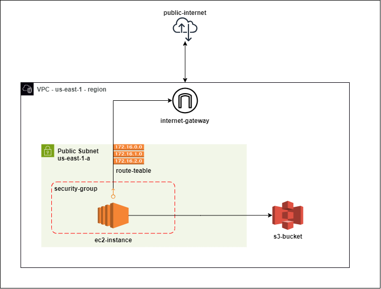

# Assignment Submission - One2N x Srivatsa

## Requirements - 
- Ensure you have Git installed on your machine - [Click Here](https://git-scm.com/book/en/v2/Getting-Started-Installing-Git)
- Ensure your system has Terraform Installed - [Click Here](https://developer.hashicorp.com/terraform/tutorials/aws-get-started/install-cli)
- Python 3.x is required, and install it with an IDE of choice - [Click Here](https://code.visualstudio.com/docs/python/python-tutorial)
- Configure `aws-cli` with `~/.aws` directory for Terraform and Boto3 SDK - [Click Here](https://wellarchitectedlabs.com/common/documentation/aws_credentials/)

## Action On - Local Machine (Laptop)
- On your Linux Machine - go to `cd /home`
- Clone Terraform Repository - `git clone https://github.com/SrivatsaRv/one2n-assignment-aws-terraform-infra.git`

### Step-1 - Provision the AWS infrastructure with Terraform
- Confirm terraform installation on your machine with - `terraform --version`
- Navigate to Terraform Working Directory -  `cd one2n-assignment-aws-terraform-infra`, 
- Initialize Terraform - `terraform init`
- Verify and Format Terraform Code (optional) - `terraform fmt` and `terraform validate` - Once green - proceed with 
- Apply terraform - `terraform apply` - this will create all resources mentioned in (One2N_Assignment.drawio.png)
- You should now have a working setup deployed in your AWS as per default region configured in AWS account. 

### Step-2 - Run the code in your EC2-Instance
- Use AWS session manager , and copy over your credential files to ec2-user's `/home`, create and populate `~/.aws` directory on EC2
- Clone the Python HTTP server repository with - `git clone https://github.com/SrivatsaRv/one2n-vatsa.git` 
- Get it running with `python3 python-http-s3.py` 
- You will now have the Flask App running - access it with `http://<public-ec2-ip>:5000/list-bucket-contents`

### Terminate all resources 
- Use `terraform destroy` to cleanup after you have tested to your satisfaction

## Assumptions -
- You have configured your AWS Root Account -> Created an IAM Account (Administrators) , 
- Our Terraform takes care from IAM (EC2 -> S3 Read access onwards)

## Notice 
- Ensure you do not include `~/.aws` file in your Git repo , it should stay in your `/home` path
- 

### Proposed Architecture for Assignment
