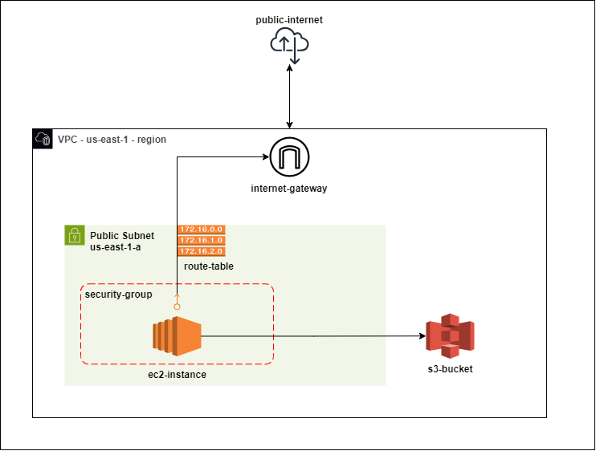

# Assignment Submission - One2N x Srivatsa

### How to get this running?
- We have 2 files , `python-http-s3.py` and `aws-s3-infra.tf` in the repository, 
- Clone the repo with - `https://github.com/<your-username>/one2n-vatsa.git`

- Initialise terraform `.tf` with terraform init -> terraform plan -> terraform apply 
- Run the `.py` file , and this will start off the HTTP server running on localhost,

### Requirements
- Ensure your system has Terraform Installed - [Click Here](https://developer.hashicorp.com/terraform/tutorials/aws-get-started/install-cli)
- Ensure you have Git Installed - [Click Here](https://git-scm.com/book/en/v2/Getting-Started-Installing-Git)
- Configure your AWS Account `AWS_ACCESS_KEY_ID` and `AWS_SECRET_ACCESS_KEY` for Terraform on System- [Click Here](https://spacelift.io/blog/terraform-aws-provider)

### Proposed Architecture for Assignment
